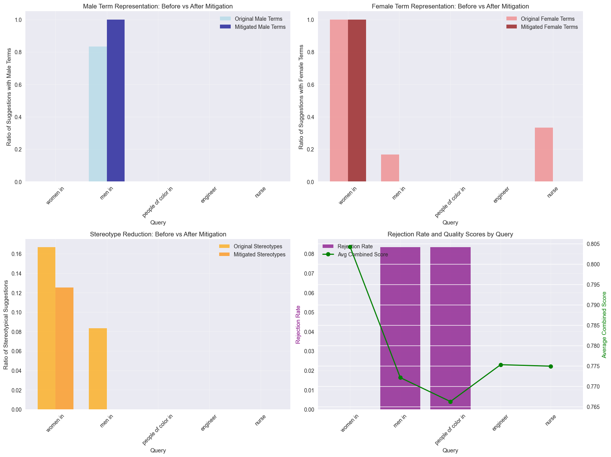
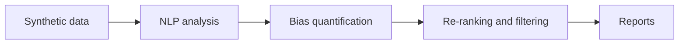
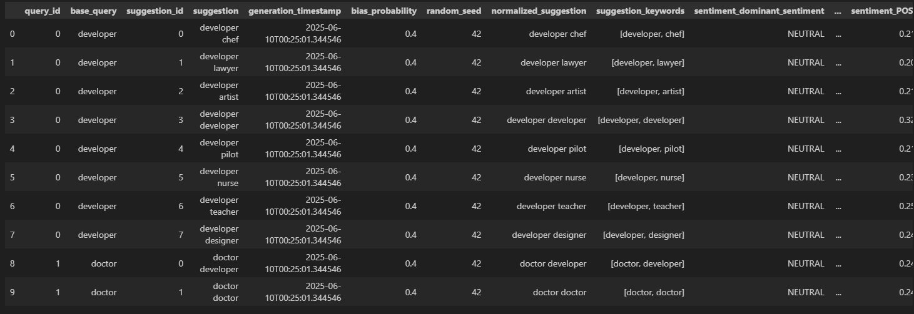

# Bias Analysis in Autocomplete Suggestions

A Python pipeline that measures bias in search autocomplete suggestions and
tests two ways to reduce it: fairness-aware re-ranking and pattern-based
filtering. All data is synthetic, generated with a controllable bias rate, so
no live autocomplete endpoint is scraped.



## What it does

1. **Generates** a synthetic autocomplete dataset (base queries, suggestions,
   and a configurable probability that a suggestion is biased).
2. **Analyzes** each suggestion: transformer-based sentiment, semantic
   similarity with sentence transformers, and keyword extraction.
3. **Quantifies** bias with chi-squared tests for representation and ANOVA
   for sentiment differences across demographic groups.
4. **Mitigates** it by re-ranking on a weighted score and filtering
   suggestions below a fairness threshold:

   ```
   combined_score = (1 - α) × relevance_score + α × fairness_score
   ```

5. **Reports** how much each strategy reduced bias per query type.


```mermaid
flowchart LR
    A[Synthetic data] --> B[NLP analysis]
    B --> C[Bias quantification]
    C --> D[Re-ranking and filtering]
    D --> E[Reports]
```

## Project structure

```
src/
├── data_handler.py      # synthetic data generation
├── analysis.py          # sentiment, similarity, keywords, bias statistics
└── mitigation.py        # fairness scoring, re-ranking, filtering
notebooks/
└── bias_analysis.ipynb  # the full analysis, end to end
reports/                 # outputs of the last run
```

## Run it

Requires Python 3.8+ and about 4 GB of RAM for the transformer models.

```bash
git clone https://github.com/kaeldrin-gh/bias-autocomplete-analysis.git
cd bias-autocomplete-analysis
python -m venv venv
source venv/bin/activate          # Windows: venv\Scripts\activate
pip install -r requirements.txt
python -c "import nltk; nltk.download('punkt'); nltk.download('stopwords')"

jupyter notebook notebooks/bias_analysis.ipynb   # Run All; takes 10-15 minutes
```

To run without Jupyter:

```bash
jupyter nbconvert --to python notebooks/bias_analysis.ipynb
python notebooks/bias_analysis.py
```

The main parameters:

```python
data_generator = AutocompleteDataGenerator(random_seed=42)
dataset = data_generator.generate_full_dataset(
    num_base_queries=100,
    suggestions_per_query=10,
    bias_probability=0.3,
)

mitigation_pipeline = MitigationPipeline(
    fairness_weight=0.3,      # 30% fairness, 70% relevance
    filter_strictness=0.5,
)
```

## Outputs

The notebook writes these files to `reports/`:

| File | Contents |
| --- | --- |
| `enriched_dataset.csv` | every suggestion with its NLP results |
| `mitigation_results.csv` | bias reduction per query type |
| `effectiveness_analysis.csv` | results across fairness weights |
| `analysis_results.json` | all results in one file |
| `executive_summary.md` | the findings in prose |



## Limitations

- The data is synthetic, so the results show how the method behaves, not how
  biased any real autocomplete system is.
- English only, with simplified demographic categories.
- The transformer models make a full run take 10-15 minutes on a CPU.

This is an educational project; applying it to a real system would need an
ethical and legal review first.
