# Bias Analysis in Autocomplete Suggestions

## Project Overview

This project implements an end-to-end Python system for analyzing and mitigating bias in search query autocomplete suggestions. The system demonstrates proficiency in data processing, NLP analysis, statistical measurement, and fairness-aware algorithm design.

### Example Output


### Key Features

- **Synthetic Data Generation**: Creates realistic autocomplete datasets without scraping live endpoints
- **Comprehensive NLP Analysis**: Sentiment analysis, semantic similarity, and text processing
- **Statistical Bias Quantification**: Chi-squared tests, ANOVA, and demographic analysis
- **Fairness-Aware Mitigation**: Re-ranking algorithms and bias filtering strategies
- **End-to-End Pipeline**: Modular, reproducible, and well-documented workflow

### Ethical Considerations

⚠️ **Important**: All data used in this project is synthetically generated to avoid ethical concerns with scraping live autocomplete endpoints. This is a research and educational project demonstrating bias analysis techniques. Real-world deployment would require careful ethical review and compliance with applicable laws.

## Project Structure

```
bias-autocomplete/
├── src/                          # Source code modules
│   ├── __init__.py              # Package initialization
│   ├── data_handler.py          # Data generation and processing
│   ├── analysis.py              # NLP analysis pipeline
│   └── mitigation.py            # Bias mitigation strategies
├── data/                        # Generated datasets
├── notebooks/                   # Jupyter notebooks
│   └── bias_analysis.ipynb     # Main analysis notebook
├── reports/                     # Generated reports and results
├── requirements.txt             # Python dependencies
└── README.md                   # This file
```

## Setup Instructions

### Prerequisites

- Python 3.8 or higher
- pip package manager
- At least 4GB RAM (for transformer models)

### Installation

1. **Clone or download the project**:
   ```bash
   # If using git
   git clone <repository-url>
   cd bias-autocomplete
   
   # Or download and extract the project files
   ```

2. **Create a virtual environment** (recommended):
   ```bash
   # Windows
   python -m venv venv
   venv\Scripts\activate
   
   # Linux/Mac
   python -m venv venv
   source venv/bin/activate
   ```

3. **Install dependencies**:
   ```bash
   pip install -r requirements.txt
   ```

4. **Download NLTK data** (if not automatically downloaded):
   ```bash
   python -c "import nltk; nltk.download('punkt'); nltk.download('stopwords')"
   ```

### Verification

Verify the installation by importing the modules:

```bash
python -c "from src.data_handler import AutocompleteDataGenerator; print('Installation successful!')"
```

## Execution Instructions

### Quick Start

1. **Navigate to the project directory**:
   ```bash
   cd bias-autocomplete
   ```

2. **Start Jupyter Notebook**:
   ```bash
   jupyter notebook
   ```

3. **Open and run the main analysis notebook**:
   - Navigate to `notebooks/bias_analysis.ipynb`
   - Run all cells in sequence (Cell → Run All)
   - The complete analysis takes approximately 10-15 minutes

### Step-by-Step Execution

The analysis pipeline consists of the following stages:

1. **Environment Setup**: Import libraries and configure logging
2. **Data Generation**: Create synthetic autocomplete dataset
3. **NLP Analysis**: Perform sentiment analysis and text processing
4. **Bias Quantification**: Statistical tests and demographic analysis
5. **Mitigation Strategies**: Fairness-aware re-ranking and filtering
6. **Results Evaluation**: Comprehensive analysis and visualization
7. **Report Generation**: Save results and create summary reports

### Alternative Execution (Command Line)

For automated execution without Jupyter:

```bash
# Convert notebook to Python script
jupyter nbconvert --to python notebooks/bias_analysis.ipynb

# Run the analysis
python notebooks/bias_analysis.py
```

## Key Components

### Data Generation (`src/data_handler.py`)

- **AutocompleteDataGenerator**: Creates synthetic autocomplete suggestions
- **Configurable bias parameters**: Control the level of bias in generated data
- **Reproducible datasets**: Uses random seeds for consistent results
- **Logging and traceability**: Comprehensive parameter logging

### NLP Analysis (`src/analysis.py`)

- **TextProcessor**: Text normalization and keyword extraction
- **SentimentAnalyzer**: Transformer-based sentiment analysis
- **SemanticAnalyzer**: Semantic similarity using sentence transformers
- **BiasQuantifier**: Statistical bias measurement and testing

### Bias Mitigation (`src/mitigation.py`)

- **FairnessCalculator**: Multi-dimensional fairness scoring
- **RelevanceCalculator**: Content relevance assessment
- **FairnessAwareReranker**: Combined fairness and relevance optimization
- **BiasFilter**: Pattern-based bias filtering
- **MitigationPipeline**: Complete bias mitigation workflow

## Results and Outputs

The analysis generates several output files in the `reports/` directory:

- **enriched_dataset.csv**: Complete dataset with NLP analysis results
- **mitigation_results.csv**: Bias mitigation effectiveness by query type  
- **effectiveness_analysis.csv**: Fairness weight optimization results
- **analysis_results.json**: Complete analysis results in JSON format
- **executive_summary.md**: High-level findings and recommendations

### Sample Output Table

Below is a sample of the enriched autocomplete dataset generated and analyzed by the pipeline:


## Technical Specifications

### Dependencies

All dependencies are pinned for reproducibility:

- **requests==2.31.0**: HTTP requests (not used for live scraping)
- **pandas==2.2.0**: Data manipulation and analysis
- **numpy==1.26.3**: Numerical computing
- **scikit-learn==1.4.0**: Machine learning utilities
- **transformers==4.36.2**: NLP transformer models
- **nltk==3.8.1**: Natural language processing
- **matplotlib==3.8.2**: Data visualization
- **seaborn==0.13.2**: Statistical visualization

### Performance Considerations

- **Memory usage**: ~2-4GB RAM for transformer models
- **Execution time**: 10-15 minutes for complete analysis
- **CPU usage**: Benefits from multi-core processors
- **Storage**: ~50MB for generated datasets and results

### Customization

The system is highly configurable:

```python
# Data generation parameters
data_generator = AutocompleteDataGenerator(random_seed=42)
dataset = data_generator.generate_full_dataset(
    num_base_queries=100,        # Number of base queries
    suggestions_per_query=10,    # Suggestions per query
    bias_probability=0.3         # Probability of biased suggestions
)

# Mitigation parameters
mitigation_pipeline = MitigationPipeline(
    fairness_weight=0.3,         # Balance: 30% fairness, 70% relevance
    filter_strictness=0.5        # Bias filtering strictness
)
```

## Methodology

### Analysis Pipeline

```mermaid
flowchart TD
    A[Start: Synthetic Data Generation] --> B[Data Preprocessing]
    B --> C[NLP Analysis]
    C --> C1[Sentiment Analysis]
    C --> C2[Semantic Similarity]
    C --> C3[Keyword Extraction]
    C1 --> D[Bias Quantification]
    C2 --> D
    C3 --> D
    D --> D1[Demographic Analysis]
    D --> D2[Statistical Testing]
    D --> D3[Bias Metrics Calculation]
    D1 --> E[Bias Mitigation]
    D2 --> E
    D3 --> E
    E --> E1[Fairness-Aware Re-ranking]
    E --> E2[Bias Filtering]
    E --> E3[Demographic Balancing]
    E --> F[Results Evaluation & Visualization]
    F --> G[Report Generation]
    G --> H[End]
```



### Bias Detection

1. **Demographic Analysis**: Identify gender, profession, and stereotype patterns
2. **Sentiment Analysis**: Measure sentiment bias across demographic groups
3. **Statistical Testing**: Chi-squared tests for representation bias
4. **Semantic Clustering**: Identify biased suggestion patterns

### Mitigation Strategies

1. **Fairness-Aware Re-ranking**: 
   ```
   combined_score = (1-α) × relevance_score + α × fairness_score
   ```

2. **Bias Filtering**: Remove suggestions below fairness thresholds

3. **Demographic Balancing**: Ensure proportional representation

4. **Stereotype Detection**: Pattern-based problematic content removal

## Validation and Testing

The system implements comprehensive validation:

- **Reproducibility**: Fixed random seeds and versioned dependencies
- **Statistical Validation**: Multiple hypothesis testing with correction
- **Cross-Query Analysis**: Evaluation across different query types
- **Effectiveness Measurement**: Quantitative bias reduction metrics

## Limitations and Considerations

### Current Limitations

1. **Synthetic Data**: Results may not fully represent real-world bias patterns
2. **English Language**: Analysis limited to English-language suggestions
3. **Demographic Categories**: Simplified demographic classification
4. **Computational Cost**: Transformer models require significant resources

### Real-World Deployment Considerations

1. **Legal Compliance**: Ensure compliance with anti-discrimination laws
2. **User Experience**: Balance fairness with user satisfaction
3. **Performance Impact**: Monitor latency and throughput
4. **Continuous Monitoring**: Implement real-time bias detection
5. **Stakeholder Training**: Educate teams on bias awareness

## Future Enhancements

1. **Intersectional Bias**: Analysis of multiple demographic dimensions
2. **Context Awareness**: Query context-sensitive fairness metrics
3. **Adversarial Training**: Neural network debiasing techniques
4. **Real-Time Monitoring**: Live bias detection dashboards
5. **Multilingual Support**: Extend analysis to multiple languages
6. **User Personalization**: Individual fairness preferences

## Contributing

This project follows software engineering best practices:

- **Code Quality**: PEP 8 compliance, type hints, comprehensive docstrings
- **Modularity**: Single-responsibility functions and classes
- **Testing**: Statistical validation and cross-validation
- **Documentation**: Google-style docstrings and inline comments
- **Reproducibility**: Versioned dependencies and deterministic algorithms

## Troubleshooting

### Common Issues

1. **Memory Error**: Reduce dataset size or upgrade system RAM
2. **Model Download Failures**: Ensure stable internet connection
3. **Import Errors**: Verify virtual environment activation
4. **Slow Execution**: Use smaller datasets for testing

### Support

For technical issues:

1. Check the requirements.txt for correct dependency versions
2. Verify Python version compatibility (3.8+)
3. Ensure sufficient system resources (4GB+ RAM)
4. Review error logs for specific failure modes

## License and Citation

This project is for educational and research purposes. When using or adapting this work, please consider:

- Citing the methodology and approach
- Acknowledging the synthetic nature of the data
- Following ethical guidelines for bias analysis
- Complying with applicable laws and regulations

## Conclusion

This bias analysis system demonstrates a comprehensive approach to detecting and mitigating bias in autocomplete suggestions. The modular design, statistical rigor, and fairness-aware algorithms provide a solid foundation for addressing bias in information retrieval systems while maintaining system utility and user experience.

The synthetic data approach ensures ethical compliance while enabling thorough analysis of bias patterns and mitigation strategies. The results provide actionable insights for improving fairness in autocomplete systems and establish a framework for ongoing bias monitoring and mitigation.

---

*Generated by the Bias Autocomplete Analysis System - A comprehensive toolkit for fairness in information retrieval.*
